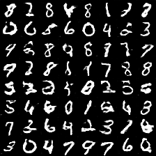
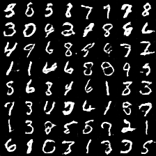
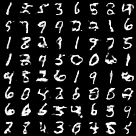
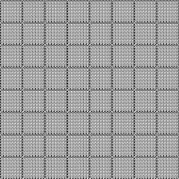
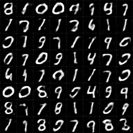

# tensorflow-generative-model-collections
Tensorflow implementation of various GANs and VAEs.

## Generative Adversarial Networks (GANs)
### Lists  

*Name* | *Paer Link* | *Loss Function*
:---: | :---: | :--- |
**GAN** | [Arxiv](https://arxiv.org/abs/1406.2661) | 
**LSGAN**| [Arxiv](https://arxiv.org/abs/1611.04076) | 
**WGAN**| [Arxiv](https://arxiv.org/abs/1701.07875) | 
**DRAGAN**| [Arxiv](https://arxiv.org/abs/1705.07215) | 
**CGAN**| [Arxiv](https://arxiv.org/abs/1411.1784) | 
**infoGAN**| [Arxiv](https://arxiv.org/abs/1606.03657) | 
**ACGAN**| [Arxiv](https://arxiv.org/abs/1610.09585) | 
**EBGAN**| [Arxiv](https://arxiv.org/abs/1609.03126) | 
**BEGAN**| [Arxiv](https://arxiv.org/abs/1702.08431) |   

#### Variants of GAN structure


### Some results for mnist
Network architecture of generator and discriminator is the exaclty sames as in [infoGAN paper](https://arxiv.org/abs/1606.0365).  
For fair comparison of core ideas in all gan variants, all implementations for network architecture are kept same except EBGAN and BEGAN. Small modification is made for EBGAN/BEGAN, since those adopt auto-encoder strucutre for discriminator. But I tried to keep the capacity of discirminator.

The following results can be reproduced with command:  
```
python main.py --dataset mnist --gan_type <TYPE> --epoch 25 --batch_size 64
```

#### Random generation
All results are randomly sampled.

*Name* | *Epoch 1* | *Epoch 2* | *Epoch 10*
:---: | :---: | :---: | :---: |
GAN |  |  | 
LSGAN |  |  | 
WGAN |  |  | 
DRAGAN |  |  | 
EBGAN |  |  | 
BEGAN |  |  | 

#### Conditional generation
Each row has the same noise vector and each column has the same label condition.

*Name* | *Epoch 1* | *Epoch 10* | *Epoch 25*
:---: | :---: | :---: | :---: |
CGAN |  |  | 
ACGAN |  |  | 
infoGAN |  |  | 

#### InfoGAN : Manipulating two continous codes
<table align='center'>
<td></td>
<td></td>
<td></td>
<td></td>
</table>

### Some results for fashion-mnist
Comments on network architecture in mnist are also applied to here.  
[Fasion-mnist](https://github.com/zalandoresearch/fashion-mnist) is a recently proposed dataset consisting of a training set of 60,000 examples and a test set of 10,000 examples. Each example is a 28x28 grayscale image, associated with a label from 10 classes. (T-shirt/top, Trouser, Pullover, Dress, Coat, Sandal, Shirt, Sneaker, Bag, Ankle boot)

The following results can be reproduced with command:  
```
python main.py --dataset fashion-mnist --gan_type <TYPE> --epoch 40 --batch_size 100
```

#### Random generation
All results are randomly sampled.

*Name* | *Epoch 1* | *Epoch 20* | *Epoch 40*
:---: | :---: | :---: | :---: |
GAN |  |  | 
LSGAN |  |  | 
WGAN |  |  | 
DRAGAN |  |  | 
EBGAN |  |  | 
BEGAN |  |  | 

#### Conditional generation
Each row has the same noise vector and each column has the same label condition.

*Name* | *Epoch 1* | *Epoch 20* | *Epoch 40*
:---: | :---: | :---: | :---: |
CGAN |  |  | 
ACGAN |  |  | 
infoGAN |  |  | 

#### InfoGAN : Manipulating two continous codes
<table align='center'>
<td></td>
<td></td>
<td></td>
<td></td>
</table>

### Some results for celebA
(to be added)

## Variational Auto-Encoders (VAEs)

### Lists

*Name* | *Paper Link* |
:---: | :---: |
**VAE**| [Arxiv](https://arxiv.org/abs/1312.6114) 
**CVAE**| [Arxiv](https://arxiv.org/abs/1406.5298) 
**DVAE**| [Arxiv](https://arxiv.org/abs/1511.06406) 
**AAE**| [Arxiv](https://arxiv.org/abs/1511.05644) 

### Some results for mnist
(to be added)
### Some results for fashion-mnist
(to be added)
### Some results for celebA
(to be added)

## Acknowledgements
This implementation has been based on [this repository](https://github.com/carpedm20/DCGAN-tensorflow) and tested with Tensorflow over ver1.0 on Windows 10 and Ubuntu 14.04.
