# tensorflow-generative-model-collections
Tensorflow implementation of various GANs and VAEs.

## Related Repositories
### Pytorch version
Pytorch version of this repository is availabel at https://github.com/znxlwm/pytorch-generative-model-collections

### "Are GANs Created Equal? A Large-Scale Study" Paper 
https://github.com/google/compare_gan is the code that was used in [the paper](https://arxiv.org/abs/1711.10337).  
It provides IS/FID and rich experimental results for all gan-variants.  

## Generative Adversarial Networks (GANs)
### Lists  

*Name* | *Paper Link* | *Value Function*
:---: | :---: | :--- |
**GAN** | [Arxiv](https://arxiv.org/abs/1406.2661) | 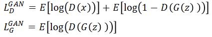
**LSGAN**| [Arxiv](https://arxiv.org/abs/1611.04076) | 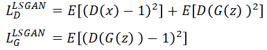
**WGAN**| [Arxiv](https://arxiv.org/abs/1701.07875) | 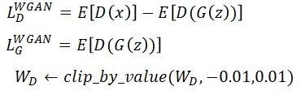
**WGAN_GP**| [Arxiv](https://arxiv.org/abs/1704.00028) | 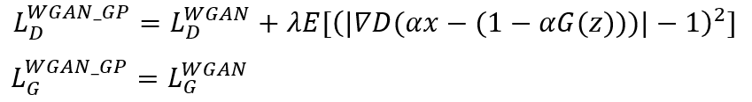
**DRAGAN**| [Arxiv](https://arxiv.org/abs/1705.07215) | 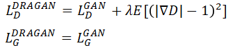
**CGAN**| [Arxiv](https://arxiv.org/abs/1411.1784) | 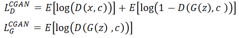
**infoGAN**| [Arxiv](https://arxiv.org/abs/1606.03657) | 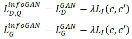
**ACGAN**| [Arxiv](https://arxiv.org/abs/1610.09585) | 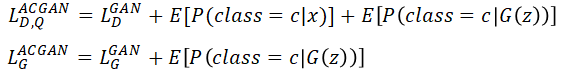
**EBGAN**| [Arxiv](https://arxiv.org/abs/1609.03126) | 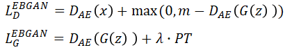
**BEGAN**| [Arxiv](https://arxiv.org/abs/1702.08431) | 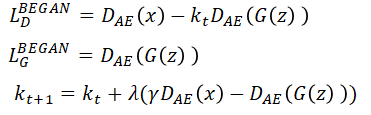  

#### Variants of GAN structure
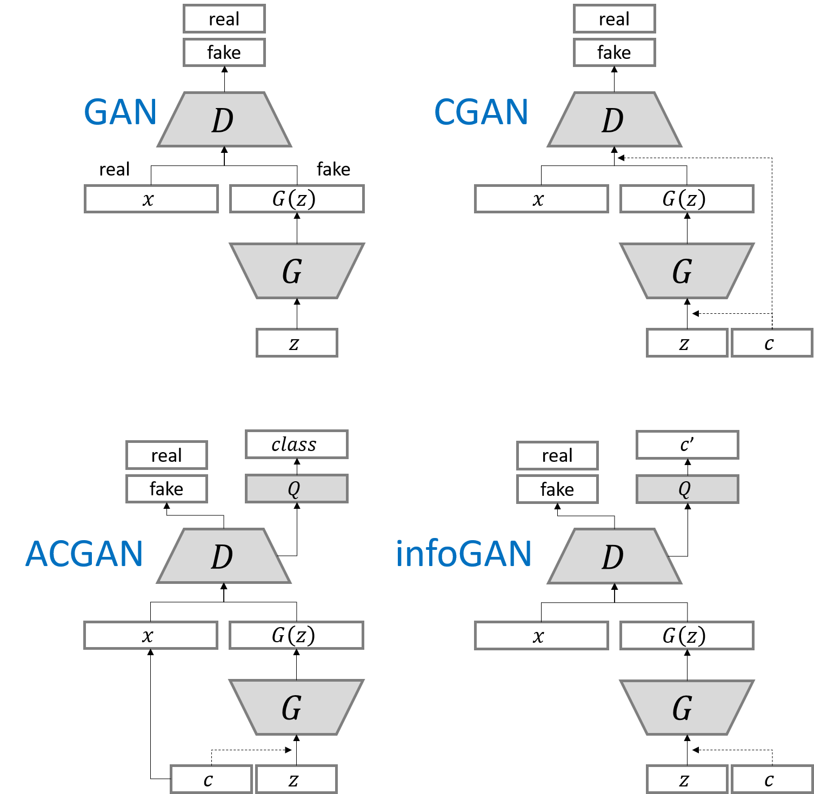

### Results for mnist
Network architecture of generator and discriminator is the exaclty sames as in [infoGAN paper](https://arxiv.org/abs/1606.03657).  
For fair comparison of core ideas in all gan variants, all implementations for network architecture are kept same except EBGAN and BEGAN. Small modification is made for EBGAN/BEGAN, since those adopt auto-encoder strucutre for discriminator. But I tried to keep the capacity of discirminator.

The following results can be reproduced with command:  
```
python main.py --dataset mnist --gan_type <TYPE> --epoch 25 --batch_size 64
```

#### Random generation
All results are randomly sampled.

*Name* | *Epoch 2* | *Epoch 10* | *Epoch 25*
:---: | :---: | :---: | :---: |
GAN | 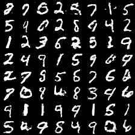 | 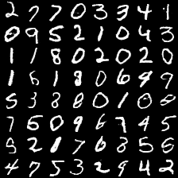 | 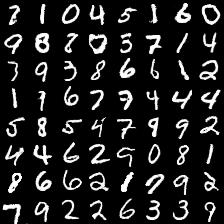
LSGAN | 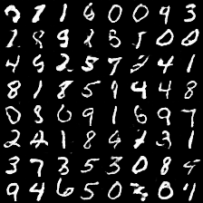 | 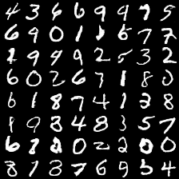 | 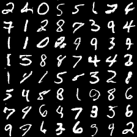
WGAN | 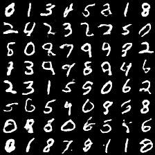 | 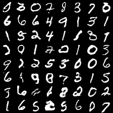 | 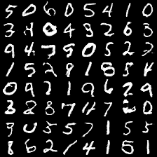
WGAN_GP | 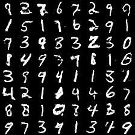 | 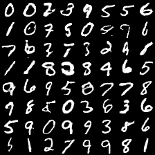 | 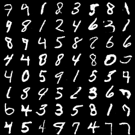
DRAGAN | 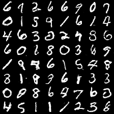 | 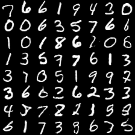 | 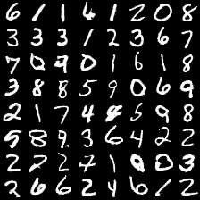
EBGAN | 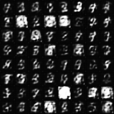 | 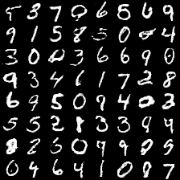 | 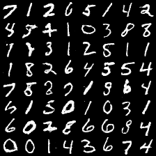
BEGAN | 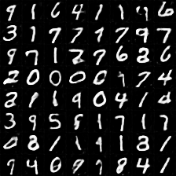 | 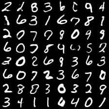 | 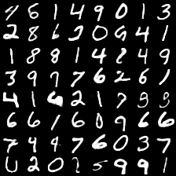

#### Conditional generation
Each row has the same noise vector and each column has the same label condition.

*Name* | *Epoch 1* | *Epoch 10* | *Epoch 25*
:---: | :---: | :---: | :---: |
CGAN | 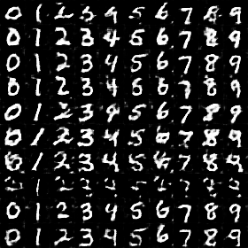 | 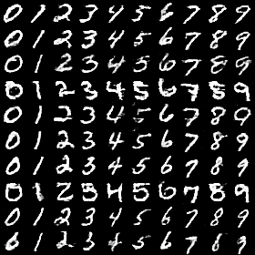 | 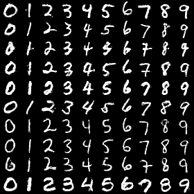
ACGAN | 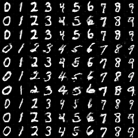 | 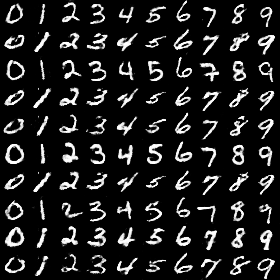 | 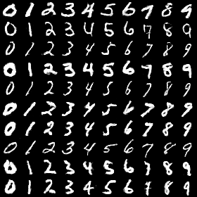
infoGAN | 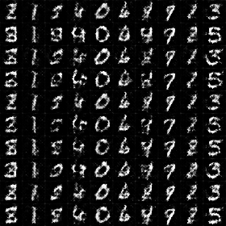 | 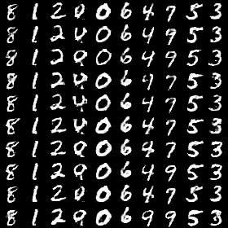 | 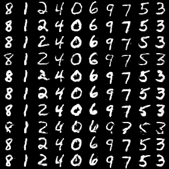

#### InfoGAN : Manipulating two continous codes
<table align='center'>
<td>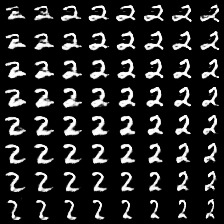</td>
<td></td>
<td>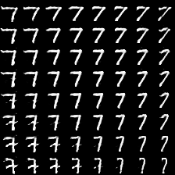</td>
<td>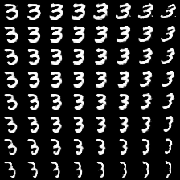</td>
</table>

### Results for fashion-mnist
Comments on network architecture in mnist are also applied to here.  
[Fashion-mnist](https://github.com/zalandoresearch/fashion-mnist) is a recently proposed dataset consisting of a training set of 60,000 examples and a test set of 10,000 examples. Each example is a 28x28 grayscale image, associated with a label from 10 classes. (T-shirt/top, Trouser, Pullover, Dress, Coat, Sandal, Shirt, Sneaker, Bag, Ankle boot)

The following results can be reproduced with command:  
```
python main.py --dataset fashion-mnist --gan_type <TYPE> --epoch 40 --batch_size 64
```

#### Random generation
All results are randomly sampled.

*Name* | *Epoch 1* | *Epoch 20* | *Epoch 40*
:---: | :---: | :---: | :---: |
GAN | 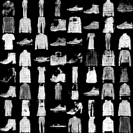 | 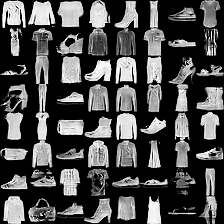 | 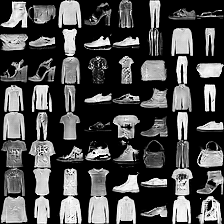
LSGAN | 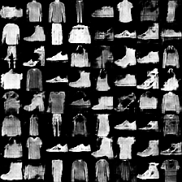 | 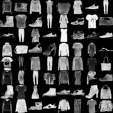 | 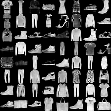
WGAN |  |  | 
WGAN_GP |  |  | 
DRAGAN |  |  | 
EBGAN |  |  | 
BEGAN |  |  | 

#### Conditional generation
Each row has the same noise vector and each column has the same label condition.

*Name* | *Epoch 1* | *Epoch 20* | *Epoch 40*
:---: | :---: | :---: | :---: |
CGAN |  |  | 
ACGAN |  |  | 
infoGAN |  |  | 

Without hyper-parameter tuning from mnist-version, ACGAN/infoGAN does not work well as compared with CGAN.  
ACGAN tends to fall into mode-collapse.  
infoGAN tends to ignore noise-vector. It results in that various style within the same class can not be represented.

#### InfoGAN : Manipulating two continous codes
<table align='center'>
<td></td>
<td></td>
<td></td>
<td></td>
</table>

### Some results for celebA
(to be added)

## Variational Auto-Encoders (VAEs)

### Lists

*Name* | *Paper Link* | *Loss Function*
:---: | :---: | :---
**VAE**| [Arxiv](https://arxiv.org/abs/1312.6114) | 
**CVAE**| [Arxiv](https://arxiv.org/abs/1406.5298) | 
**DVAE**| [Arxiv](https://arxiv.org/abs/1511.06406) | (to be added)
**AAE**| [Arxiv](https://arxiv.org/abs/1511.05644) | (to be added) 

#### Variants of VAE structure


### Results for mnist
Network architecture of decoder(generator) and encoder(discriminator) is the exaclty sames as in [infoGAN paper](https://arxiv.org/abs/1606.0365). The number of output nodes in encoder is different. (2x z_dim for VAE, 1 for GAN)

The following results can be reproduced with command:  
```
python main.py --dataset mnist --gan_type <TYPE> --epoch 25 --batch_size 64
```

#### Random generation
All results are randomly sampled.

*Name* | *Epoch 1* | *Epoch 10* | *Epoch 25*
:---: | :---: | :---: | :---: |
VAE |  |  | 
GAN |  |  | 

Results of GAN is also given to compare images generated from VAE and GAN.
The main difference (VAE generates smooth and blurry images, otherwise GAN generates sharp and artifact images) is cleary observed from the results.

#### Conditional generation
Each row has the same noise vector and each column has the same label condition.

*Name* | *Epoch 1* | *Epoch 10* | *Epoch 25*
:---: | :---: | :---: | :---: |
CVAE |  |  | 
CGAN |  |  | 

Results of CGAN is also given to compare images generated from CVAE and CGAN.

#### Learned manifold

The following results can be reproduced with command:  
```
python main.py --dataset mnist --gan_type VAE --epoch 25 --batch_size 64 --dim_z 2
```
Please notice that dimension of noise-vector z is 2.

*Name* | *Epoch 1* | *Epoch 10* | *Epoch 25*
:---: | :---: | :---: | :---: |
VAE |  |  | 

### Results for fashion-mnist
Comments on network architecture in mnist are also applied to here. 

The following results can be reproduced with command:  
```
python main.py --dataset fashion-mnist --gan_type <TYPE> --epoch 40 --batch_size 64
```

#### Random generation
All results are randomly sampled.

*Name* | *Epoch 1* | *Epoch 20* | *Epoch 40*
:---: | :---: | :---: | :---: |
VAE |  |  | 
GAN |  |  | 

Results of GAN is also given to compare images generated from VAE and GAN.

#### Conditional generation
Each row has the same noise vector and each column has the same label condition.

*Name* | *Epoch 1* | *Epoch 20* | *Epoch 40*
:---: | :---: | :---: | :---: |
CVAE |  |  | 
CGAN |  |  | 

Results of CGAN is also given to compare images generated from CVAE and CGAN.

#### Learned manifold

The following results can be reproduced with command:  
```
python main.py --dataset fashion-mnist --gan_type VAE --epoch 25 --batch_size 64 --dim_z 2
```
Please notice that dimension of noise-vector z is 2.

*Name* | *Epoch 1* | *Epoch 10* | *Epoch 25*
:---: | :---: | :---: | :---: |
VAE |  |  | 

### Results for celebA
(to be added)

## Folder structure
The following shows basic folder structure.
```
├── main.py # gateway
├── data
│   ├── mnist # mnist data (not included in this repo)
│   |   ├── t10k-images-idx3-ubyte.gz
│   |   ├── t10k-labels-idx1-ubyte.gz
│   |   ├── train-images-idx3-ubyte.gz
│   |   └── train-labels-idx1-ubyte.gz
│   └── fashion-mnist # fashion-mnist data (not included in this repo)
│       ├── t10k-images-idx3-ubyte.gz
│       ├── t10k-labels-idx1-ubyte.gz
│       ├── train-images-idx3-ubyte.gz
│       └── train-labels-idx1-ubyte.gz
├── GAN.py # vanilla GAN
├── ops.py # some operations on layer
├── utils.py # utils
├── logs # log files for tensorboard to be saved here
└── checkpoint # model files to be saved here
```

## Acknowledgements
This implementation has been based on [this repository](https://github.com/carpedm20/DCGAN-tensorflow) and tested with Tensorflow over ver1.0 on Windows 10 and Ubuntu 14.04.
